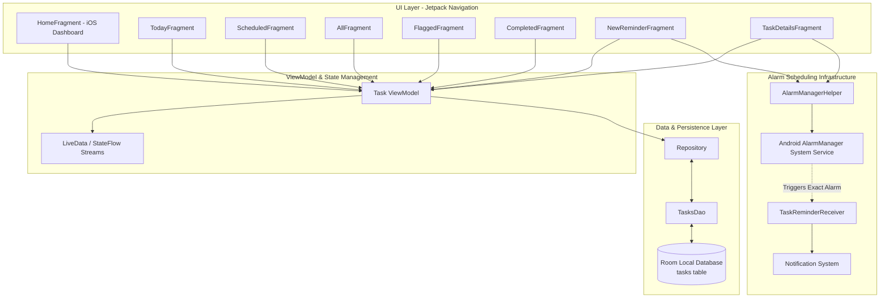

# Reminders iOS (to-do-list-offline)

[](https://www.android.com/)
[](https://kotlinlang.org/)
[](https://developer.android.com/topic/architecture)
[-4CAF50?style=for-the-badge&logo=sqlite&logoColor=white)](https://developer.android.com/training/data-storage/room)
[](https://developer.android.com/)
[-00BCD4?style=for-the-badge)](https://developer.android.com/)
[](LICENSE)

> A zero-cloud, 100% offline iOS Reminders recreation for Android, featuring local Room database persistence, ultra-smooth pull-to-refresh interactions, and precision AlarmManager scheduling.

---

## 📖 Overview

**Reminders iOS Offline** is a privacy-first task management and reminder client built for Android. It recreates the iconic Apple iOS Reminders aesthetic and organization workflow while guaranteeing complete data sovereignty — all tasks, dates, notes, and completion statuses remain strictly on the user's physical device without requiring an account, network connection, or cloud backend.

By combining modern Android Jetpack libraries (**Room ORM**, **ViewModel**, **Kotlin Flow**, **Navigation Component**) with custom iOS-styled widgets and smooth pull-to-refresh physics (`ultra-ptr`), the application offers an ultra-fast, zero-latency daily planning companion.

### Why Reminders iOS Offline?
- **100% Privacy & Data Sovereignty**: No sign-in required, zero network permissions needed for data, zero telemetry.
- **True iOS Reminders UX**: Distinct rounded card tiles for **Today**, **Scheduled**, **All**, **Flagged**, and **Completed**, complete with dynamic colored badge counts.
- **Precision Local Alarms**: Leverages Android’s `AlarmManager` with `SCHEDULE_EXACT_ALARM` to deliver reliable local reminders right on time.
- **Fluid Micro-Interactions**: Enhanced with iOS-like elastic bounce and pull-to-refresh physics.

---

## 🏗️ Architecture & Data Flow

Reminders iOS Offline strictly adheres to the **Android Jetpack MVVM (Model-View-ViewModel)** architecture and repository pattern.



---

## ✨ Core Features

### 🗂️ iOS-Inspired Smart Categories
- **Today**: Filters and displays all active reminders due on the current system date.
- **Scheduled**: Chronological timeline of upcoming tasks with upcoming deadline markers.
- **All Incomplete**: Comprehensive overview of pending to-do items across all lists.
- **Flagged**: Priority dashboard highlighting items marked as urgent.
- **Completed**: Task completion archive tracking completion date timestamps (`dateCompleted`) with instant bulk-clear.
- **Custom Groups**: Dedicated views for iCloud and Outlook grouped lists.

### 💾 Local Room Database Persistence
- SQLite table schema (`tasks`) storing unique auto-generated IDs, title, detailed notes, date, time, time category (morning/afternoon/tonight), timestamp, flag status, and completion state.
- Reactive `Flow` queries for live count recalculations across dashboard cards.

### ⏰ Exact Local Notification Scheduling
- Integrates `AlarmManager` with `PendingIntent` triggers to wake up the broadcast receiver at exact scheduled timestamps.
- Native Android notification channel with heads-up alerts and deep-link intent routing directly to task details.

### 📱 Fluid Micro-Interactions & iOS Pull-to-Refresh
- Utilizes the `ultra-ptr` pull-to-refresh library for iOS-inspired gesture physics and smooth list reload transitions.
- Custom custom card layouts with rounded corners and typography faithful to iOS Human Interface Guidelines.

---

## 📱 Key Screens & UI Components

| Screen / Component | Class | Description |
|---|---|---|
| **Home Dashboard** | `HomeFragment` | iOS Reminders multi-card dashboard with dynamic live counter badges. |
| **New Reminder** | `NewReminderFragment` | Create task sheet with title, notes, date picker, time picker, and flag toggle. |
| **Today View** | `TodayFragment` | Filtered list of tasks scheduled for today with real-time checkbox toggling. |
| **Scheduled View** | `ScheduledFragment` | Upcoming scheduled tasks filtered by date ranges. |
| **All Tasks** | `AllFragment` | Master list of all active pending tasks. |
| **Flagged View** | `FlaggedFragment` | Priority task list displaying flagged reminders. |
| **Completed View**| `CompletedFragment` | Completed task history with action bar menu to clear all. |
| **Task Details** | `TaskDetailsFragment` | Edit title, modify notes, update due dates/times, and reschedule alarms. |

---

## 🛠️ Technical Stack Matrix

| Layer / Concern | Technology / Library | Version / Purpose |
|---|---|---|
| **Language** | [Kotlin](https://kotlinlang.org/) | 1.9+ |
| **Min / Target SDK** | Android SDK | `minSdk 26` (Android 8.0) / `targetSdk 35` (Android 15) / `compileSdk 35` |
| **Architecture** | MVVM + Repository Pattern | Android Jetpack Architecture Components |
| **Local Database** | [Room Persistence Library](https://developer.android.com/training/data-storage/room) | SQLite ORM compiled with Kotlin Symbol Processing (KSP) |
| **Concurrency** | Kotlin Coroutines & Flow | Asynchronous database transactions and reactive UI data streams |
| **UI Components** | AndroidX, Material Design 3, ViewBinding | Material Components, CardViews, Custom Toolbar, RecyclerViews |
| **Pull-to-Refresh** | [Ultra PTR](https://github.com/liaohuqiu/android-Ultra-Pull-To-Refresh) | iOS-inspired elastic pull-to-refresh physics |
| **Scheduling** | Android `AlarmManager` & `BroadcastReceiver` | Exact background alarm triggering (`SCHEDULE_EXACT_ALARM`) |
| **Build System** | Gradle Kotlin DSL (`build.gradle.kts`) | AGP 8.10+ with Version Catalogs (`libs.versions.toml`) |

---

## 📂 Project Structure

```text
to-do-list-offline/
├── app/
│   ├── src/
│   │   ├── main/
│   │   │   ├── java/com/shayan/remindersios/
│   │   │   │   ├── adapters/
│   │   │   │   │   └── TaskAdapter.kt             # RecyclerView task list adapter
│   │   │   │   ├── data/
│   │   │   │   │   ├── local/
│   │   │   │   │   │   ├── AppDatabase.kt         # Room database singleton
│   │   │   │   │   │   └── dao/TasksDao.kt        # Room DAO queries & Flow streams
│   │   │   │   │   ├── models/Tasks.kt            # Room Task data entity
│   │   │   │   │   └── repository/Repository.kt   # Local database repository
│   │   │   │   ├── receivers/
│   │   │   │   │   └── TaskReminderReceiver.kt    # Exact alarm broadcast receiver
│   │   │   │   ├── ui/
│   │   │   │   │   ├── MainActivity.kt            # Host Activity
│   │   │   │   │   ├── fragments/                 # UI navigation destination fragments
│   │   │   │   │   └── viewmodel/ViewModel.kt     # Shared ViewModel
│   │   │   │   └── utils/
│   │   │   │       ├── AlarmManagerHelper.kt      # AlarmManager scheduler utility
│   │   │   │       ├── Notification.kt            # Notification builder helper
│   │   │   │       ├── PullToRefreshUtil.kt       # Ultra PTR configuration helper
│   │   │   │       └── ToastExtensions.kt         # Toast UI extensions
│   │   │   ├── res/
│   │   │   │   ├── layout/                        # XML layout files
│   │   │   │   ├── navigation/nav_graph.xml       # Jetpack navigation graph
│   │   │   │   └── values/                        # Colors, dimensions, themes
│   │   │   └── AndroidManifest.xml
│   ├── build.gradle.kts
│   └── proguard-rules.pro
├── screenshots/
│   ├── IMG_3339.JPG
│   ├── IMG_3340.JPG
│   └── IMG_3343.JPG
├── gradle/
│   └── libs.versions.toml
├── build.gradle.kts
├── LICENSE
└── README.md
```

---

## 🚀 Getting Started

### Prerequisites
- **Android Studio** (Hedgehog 2023.1.1 or Ladybug / Koala recommended).
- **JDK 11** or **JDK 17**.
- Physical Android device or Emulator running **Android 8.0 (API level 26)** or higher.

### Installation & Build

1. **Clone the repository**:
   ```bash
   git clone https://github.com/shayann07/to-do-list-offline.git
   cd to-do-list-offline
   ```

2. **Open in Android Studio**:
   - Open the cloned directory in Android Studio and let Gradle sync complete.

3. **Build the APK**:
   ```bash
   ./gradlew assembleDebug
   ```

4. **Install on Device**:
   ```bash
   ./gradlew installDebug
   ```

> [!NOTE]
> On Android 12+ (API 31+), verify that the **Alarms & Reminders** permission is granted under `Settings -> Apps -> Reminders iOS -> Alarms & Reminders` to ensure exact alarms trigger on time.

---

## 📄 License

This project is licensed under the **MIT License** — see the [LICENSE](LICENSE) file for complete details.

```text
Copyright (c) 2026 shayann07
```
